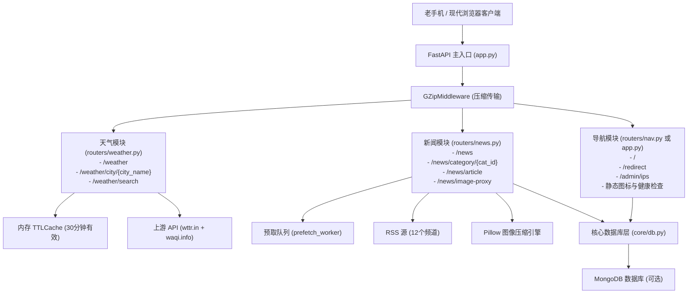

# WAP 综合门户 (Portal) 重构合并架构设计规范

- **创建日期**：2026-10-05
- **项目名称**：`portal-wap` (WAP 综合门户)
- **目标路径**：`d:\Users\Tzucet\Desktop\网站\我的WAP网站\portal-wap`
- **GitHub 仓库**：`https://github.com/amahteru/portal-wap.git`

---

## 1. 背景与目标 (Background & Goals)

### 1.1 背景
当前 WAP 生态包含三个独立的轻量级站点：
1. `nav-wap`：提供 XHTML Mobile 1.0 导航首页及访客/点击统计（Flask 3.0）；
2. `weather-wap`：提供全国省市实时天气预报与空气质量索引（Flask 3.0 + Gevent）；
3. `news-wap`：提供 12 类 RSS 实时资讯、纯净正文提取与老机图片优化（FastAPI + Motor）。

每个站点独立占用一个容器实例，维护分散且各占配额。

### 1.2 目标
* **业务合并**：将导航、天气、新闻三合一，打造“WAP 综合门户”（Portal-WAP）；
* **统一技术栈**：采用全异步高性能 **FastAPI (Python 3.11)** 架构，统一后台任务调度与 I/O 驱动；
* **保留原貌**：**门户首页（`/`）保持经典的 XHTML Mobile 1.0 排版与设计完全不变**，站内链接平滑替换；
* **单容器部署**：单一 Docker 镜像（Python 3.11-slim），标准暴露 7860 端口；
* **优雅降级**：支持配置 `MONGO_URI` 进行持久化（访客统计、新闻索引），未配置时自动降级为全内存模式，零报错正常运行。

---

## 2. 系统架构设计 (Architecture Design)



---

## 3. 代码目录结构规范 (Directory Structure)

```text
portal-wap/
├── core/
│   ├── __init__.py
│   └── db.py                  # MongoDB 异步连接池管理、集合获取与降级保护
├── routers/
│   ├── __init__.py
│   ├── weather.py             # 天气路由、全国省市字典、异步请求与页面渲染
│   └── news.py                # 新闻路由、RSS 定时抓取、正文清洗与图片处理
├── app.py                     # FastAPI 实例、生命周期、导航首页与公用端点
├── requirements.txt           # 统一依赖清单
├── Dockerfile                 # 容器构建配置 (暴露 7860 端口)
├── favicon.ico                # 站点图标
├── speeddial-icon.png         # 浏览器拨号盘快捷图标
├── .gitignore                 # Git 忽略配置
└── README.md                  # 项目说明与 Space 部署元数据
```

---

## 4. 模块详细设计 (Detailed Module Design)

### 4.1 核心数据库与缓存层 (`core/db.py`)
* 使用 `motor.motor_asyncio.AsyncIOMotorClient` 建立单一共享连接池；
* 数据库命名统一为 `portal_sites_db`，集合自动附加 `space_id` 前缀：
  * 导航 IP 集合：`nav_ips_{space_id}`
  * 导航元数据：`nav_meta_{space_id}`
  * 新闻条目集合：`news_items_{space_id}`
  * 新闻元数据：`news_meta_{space_id}`
  * 缩略图片缓存：`images_{space_id}`
* **降级支持**：若未配置 `MONGO_URI`，返回 `None`，上层模块自动退化为内存缓存，保证网站在本地开发和轻量测试时开箱即用。

### 4.2 导航核心 (`app.py`)
* **首页 `/`**：
  * 输出标准 XHTML Mobile 1.0 DTD；
  * 保留原经典标题 `WAP导航页`、问候语计算、今日访客统计、百度 WAP 搜索框；
  * 链接重定向：
    * 新闻网站：`href="/redirect?url=/news&name=新闻网站"`；
    * 天气预报：`href="/redirect?url=/weather&name=天气预报"`；
    * 社交互动（QQ群互通）与工具娱乐（AI站）维持原样；
* **辅助端点**：
  * `/redirect`：记录各链接点击次数并平滑 302 重定向；
  * `/admin/ips`：访客 IP 与点击数据 JSON 仪表盘；
  * `/health`：健康探测接口，返回 `{"status": "ok"}`。

### 4.3 天气模块 (`routers/weather.py`)
* **路由设计**：
  * `GET /weather`：天气主页，展示直辖市、各省份折叠列表、搜索框及快捷链接；
  * `GET /weather/city/{city_name}`：查询指定城市天气，聚合 `wttr.in` 3天预报与 WAQI 实时空气质量指数；
  * `GET /weather/search`：城市快速搜索支持。
* **性能与缓存**：
  * 引入 `cachetools.TTLCache(maxsize=300, ttl=1800)` 缓存天气查询结果，避免重复打崩上游；
  * 使用异步 `httpx.AsyncClient` 进行非阻塞外网请求。

### 4.4 新闻模块 (`routers/news.py`)
* **频道支持**：包含要闻、时政、国际、社会、文娱、体育、生活、健康、法治、即时、科技、理论共 12 个栏目；
* **后台工作协程**：
  * `background_refresher`：后台周期性更新 12 个 RSS 源（TTL 600秒）；
  * `prefetch_worker`：基于 `asyncio.Queue` 预提取正文，并调用 `fetch_and_cache_image` 缓存处理文章图片；
* **老手机专项优化**：
  * `trafilatura` 智能提取无干扰正文；
  * 图片代理 `/news/image-proxy`：使用 `Pillow` 自动将现代高清图片转码等比缩放为适配老手机屏幕尺寸的轻量图片，并带 HMAC-SHA256 安全防篡改校验。

---

## 5. 依赖清单与容器规约 (Dependencies & Docker)

### 5.1 `requirements.txt`
```text
fastapi>=0.110.0
uvicorn>=0.28.0
motor>=3.3.2
pymongo>=4.6.2
feedparser>=6.0.11
httpx>=0.27.0
trafilatura>=1.8.0
lxml_html_clean>=0.1.0
cachetools>=5.3.3
Pillow>=10.2.0
```

### 5.2 `Dockerfile`
```dockerfile
FROM python:3.11-slim

WORKDIR /app

COPY requirements.txt .
RUN pip install --no-cache-dir -r requirements.txt

COPY . .

EXPOSE 7860

ENV TZ=Asia/Shanghai

CMD ["uvicorn", "app:app", "--host", "0.0.0.0", "--port", "7860", "--timeout-keep-alive", "15"]
```

---

## 6. 测试与验证标准 (Verification & Testing)
1. **服务启动测试**：本地执行 `uvicorn app:app --port 7860`，验证无报错无警告；
2. **端点连通性测试**：
   * 访问 `/` 确认导航首页原汁原味加载，百度搜索可用，访客计数递增；
   * 点击进入 `/redirect?url=/weather&name=天气预报`，验证正确跳转并能查看天气数据；
   * 点击进入 `/redirect?url=/news&name=新闻网站`，验证新闻栏目加载、点击能正常阅读清洗后的文章；
3. **老机渲染测试**：验证响应头均为 `Content-Type: application/vnd.wap.xhtml+xml; charset=utf-8` 或 `text/html; charset=utf-8`，页面无多余 JS，单页体积控制在 10KB 以内；
4. **Git 同步验证**：提交代码并成功推送至 GitHub `https://github.com/amahteru/portal.git`。
